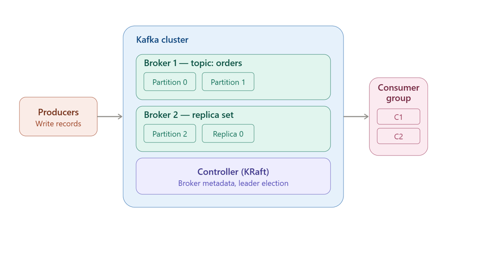

# Apache Kafka [is like a communication system that helps diff parts of a computer system exchange data by publishing and subcribing to topics ]

Sender ---Publish----> APACHE KAFKA --------->Receiver [will subscribe the topic]

# flow of data = flow of streams

# Learn with example 

# THROUGHPUT [ read and write data from database] [ which is supposed to be less ]
if throughput is high database crash [bcz database is to store data, not read and write ][solution ===> APACHE KAFKA [high throughput]

# Why we use Kafka ?
1. High Throughput [mode read and write data ]
2. Fault Tolerance [replication][bcz fault can be tolerated , it will direct to other node ]
3. Durable [data will not be erased]
4. Scalable 

# KAFKA ARCHITECTURE 

1. zookeeper [deprecated]
2. Kafka server works on  port number 9092
3. 

